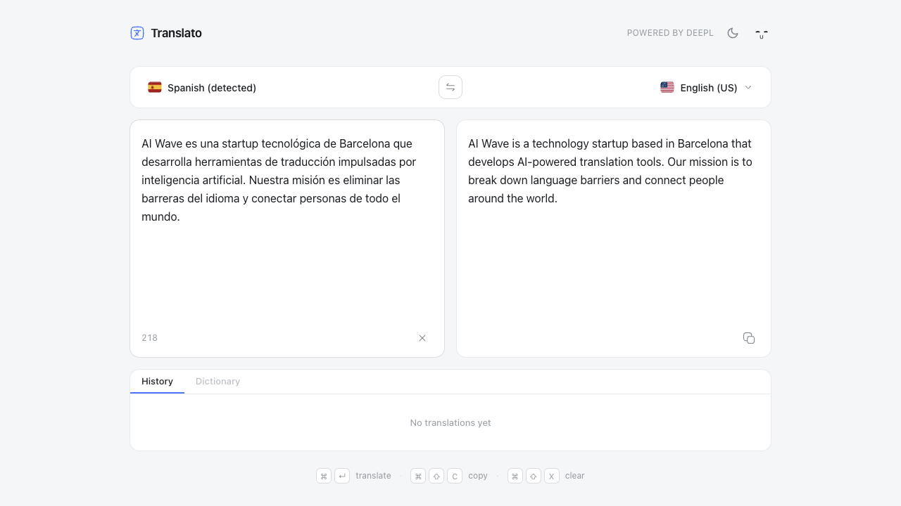
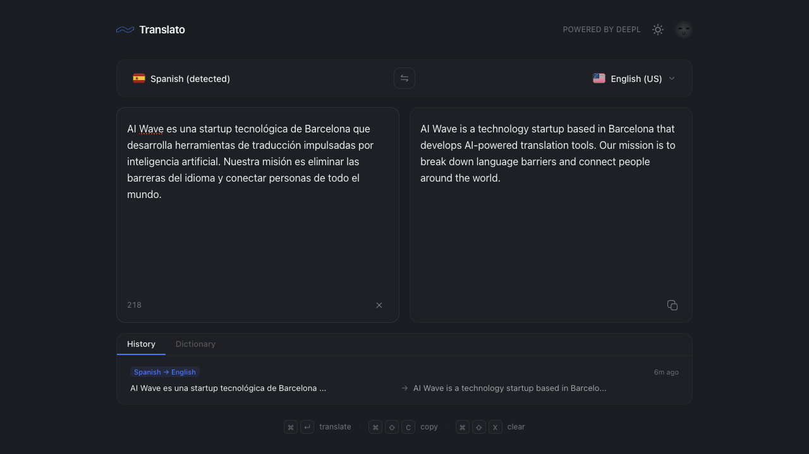

# Translato

Fast, minimal online translator powered by DeepL.


## Screenshots

### Light mode



### Dark mode



## Features

- Auto-translate on typing with 400ms debounce
- 30+ languages with source auto-detect
- Language swap with animated toggle
- Copy translated text to clipboard
- Responsive layout for desktop and mobile

## Stack

- Runtime: Bun
- Frontend: React 19 + Vite
- Backend: Convex (actions/queries/mutations)
- Auth: Clerk
- Translation API: DeepL Free API
- Styling: Design system tokens (no Tailwind)

## Setup

```bash
bun install
```

Create `.env.local` in the project root:

```env
VITE_CONVEX_URL=https://your-deployment.convex.cloud
VITE_CLERK_PUBLISHABLE_KEY=pk_test_or_pk_live_key
```

Set these server-side variables in Convex:

- `DEEPL_API_KEY`
- `CLERK_JWT_ISSUER_DOMAIN`
- `INTERNAL_ALLOWED_EMAILS`
- `INTERNAL_ALLOWED_DOMAINS`

## Run

```bash
bun --hot src/server/index.ts
bun run dev:web
```

- `bun --hot src/server/index.ts`: Bun server workflow for local development.
- `bun run dev:web`: Vite SPA workflow used for production builds.

## Project structure

```text
src/
  translator/   Domain: DeepL integration, language data, types
  server/       HTTP: Bun.serve(), local/dev-only routes
  ui/           UI: React components and styles
convex/         Backend: auth-gated actions, queries, mutations
docs/           Design system, tech stack, deployment notes
```

## Production build

```bash
bun run build
```

Build output is generated in `dist/` for Vercel deployment.

## License

Private, internal use only.
