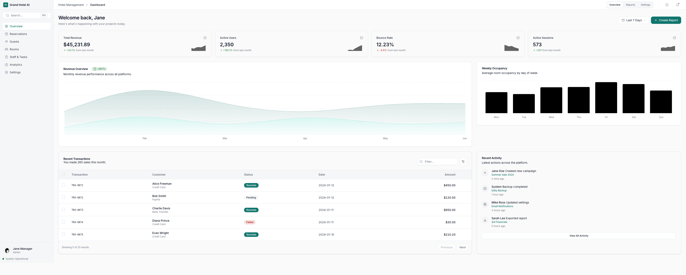

# AI Wave App Design System

**Version:** 1.0  
**Scope:** Web app product (Dashboard & Operational Views).

## Overview

This design system defines the rules, components, and patterns for building **AI Wave App**. Its goal is to guarantee a consistent, performant experience centered on user productivity.

The interface exists to **convert intention into execution with minimal friction**, always prioritizing data and actions over decoration.

## System Structure

The documentation is split into modules to make maintenance and reference easier:

### [01. Principles and Objectives](./01-principles.md)
Core product philosophy.
- **Operational clarity:** No ambiguity.
- **Execution speed:** Keyboard first.
- **Hierarchy:** Text and data > Color and decoration.

### [02. Foundations](./02-foundations.md)
The indivisible atoms of the system.
- **Typography:** Inter (single family).
- **Color:** System of neutrals and semantic accents.
- **Spacing and Radius:** Closed scales in px.
- **Motion:** Functional transitions.

### [03. Layout](./03-layout.md)
Macro structure of the app.
- **App Shell:** Sidebar, Topbar, and Inspector.
- **Grids and Breakpoints:** Responsive behavior.
- **Navigation:** Hierarchy of menus and tabs.

### [04. Components](./04-components.md)
Interactive building blocks.
- **Inputs and Controls:** Buttons, selects, toggles.
- **Feedback:** Toasts, banners, dialogs.
- **States:** Hover, focus, disabled.

### [05. Patterns](./05-patterns.md)
Recurring solutions to complex problems.
- **Prompt to Output:** The core AI flow.
- **Editable Tables:** High-density management.
- **Side Inspector:** Editing without losing context.

### [06. Governance](./06-governance.md)
How the system evolves.
- **Change process:** RFCs and versioning.
- **Synchronization:** Figma ↔ Code.

---

## Quick Start for Developers

1.  **Technology:** React 19, Tailwind CSS v4, Radix UI.
2.  **Source of Truth:** The tokens in `02-foundations.md` must match `tailwind.config.js` exactly.
3.  **Golden Rule:** Do not invent new styles. If there is no token for what you need, review whether the design is correct or start an RFC.

---
*AI Wave App Design System © 2026*
